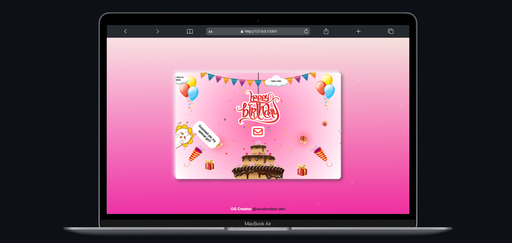

# 🎂✨ Happy Birthday Website ✨💻  
*A Code-Powered Birthday Gesture for Someone Special*  

  
*Watch the full magic on [Instagram](https://www.instagram.com/reel/DG_AZoAo7P4/?igsh=bXl0MWFseXg1NG1w)*  

---

## 🌟 **About This Project**  
I created this interactive birthday website for my crush to make her day extra special! It features:  
- 🎨 A beautifully decorated birthday card in the center of the screen.  
- 🎂 A big animated cake with festive GIFs.  
- ✨ Calligraphy-style "Happy Birthday" text.  
- 💌 A message icon that pops open with a heartfelt greeting when clicked.  

The website is fully responsive and designed to make her smile. 😊  

---

## 🚀 **Why I Built This**  
Because why send a boring text when you can code a whole website, right? 😏  
This project is my way of combining my coding skills with a heartfelt gesture. Plus, it’s a fun and creative way to celebrate someone special!  

---

## 🛠️ **Tech Stack**  
- **HTML5**: For the structure of the website.  
- **CSS3**: For styling, animations, and responsiveness.  
- **JavaScript**: For the interactive pop-up message.  
- **GIFs**: To add that extra festive vibe.  

---

## 🎥 **Instagram Reel**  
I turned this project into a reel! Check it out here: [https://www.instagram.com/reel/DG_AZoAo7P4/?igsh=bXl0MWFseXg1NG1w]  

---

## 🧑‍💻 **How to Use This Project**  
Want to surprise your crush or someone special? Here’s how you can use this project:  

1. **Clone the Repository**:  
   ```bash
   git clone https://github.com/your-username/Happy-Birthday-Website.git

2. **Customize the Content**:  
   - Replace the text, images, and GIFs with your own.  
   - Edit the pop-up message in the `script.js` file.  

3. **Host It**:  
   - Deploy it on GitHub Pages, Netlify, or any hosting platform.  
   - Share the link with your crush!  

---

## 💡 **Inspiration**  
If you’re a developer with a crush (or just someone who loves creative gestures), this project is for you! Feel free to fork it, customize it, and make someone’s day.  

---

## 🙌 **Contributions**  
Got ideas to make this project even better? Open an issue or submit a pull request! Let’s make this the ultimate birthday surprise.  

---

## 📝 **License**  
This project is open-source and available under the [MIT License](LICENSE).  

---

## 💌 **Shoutout**  
A special thanks to my crush for inspiring this project. ❤️  
*(And to all the developers out there coding their feelings instead of confessing them. 😂)*  

---

Made with ❤️ by [Aoudumber Bade](https://github.com/Aoudumber-Bade)  